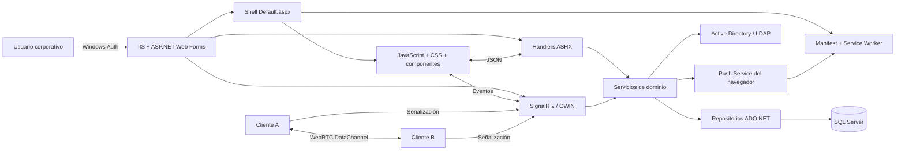

# IntraMessenger — Hoja de ruta técnica para Jules

> **Estado:** Documento rector / fuente de verdad inicial  
> **Versión:** 1.0  
> **Fecha:** 2026-07-14  
> **Nombre de trabajo:** `IntraMessenger`  
> **Plataforma objetivo:** ASP.NET Web Forms sobre .NET Framework 4.8, IIS, SQL Server y PWA instalable  
> **Autenticación:** Windows Authentication integrada con Active Directory local  
> **Referencia visual:** [`docs/assets/ui-reference-messenger-80s.png`](docs/assets/ui-reference-messenger-80s.png)

---

## 0. Cómo debe usarse este documento

Este archivo no es una descripción aspiracional. Es la **fuente de verdad técnica y funcional** del repositorio.

Jules debe:

1. Leer primero `AGENTS.md`.
2. Leer este documento completo antes de proponer un plan.
3. Ejecutar **una sola tarea identificada** por vez.
4. No iniciar una fase si sus dependencias no están terminadas.
5. No declarar una tarea completa sin cumplir sus criterios de aceptación.
6. Actualizar al final de cada tarea:
   - `docs/STATUS.md`
   - `docs/DECISIONS.md`, únicamente si tomó una decisión arquitectónica nueva.
   - la casilla correspondiente de esta hoja de ruta.
7. No alterar decisiones marcadas como **fijas** sin solicitar aprobación.
8. No afirmar que compiló la solución .NET Framework 4.8 dentro de Jules: el entorno de Jules es Ubuntu y no puede validar de forma fiable un proyecto ASP.NET Web Forms clásico dirigido a Windows.

### 0.1 Jerarquía de instrucciones

En caso de contradicción, aplicar este orden:

1. Solicitud puntual aprobada por el responsable del proyecto.
2. `AGENTS.md`.
3. Este documento.
4. `docs/DECISIONS.md`.
5. Código y pruebas existentes.
6. Comentarios históricos del código.

### 0.2 Regla de cambio controlado

Cada tarea debe tener alcance pequeño y verificable. Como guía:

- máximo recomendado de 8 archivos modificados;
- una sola preocupación funcional principal;
- sin refactorizaciones laterales no solicitadas;
- sin actualización masiva de dependencias;
- sin reescribir módulos que ya cumplen sus pruebas;
- sin crear un segundo patrón arquitectónico para resolver el mismo problema.

---

# 1. Síntesis del análisis de las guías de prompting de Google

La estrategia para trabajar con Jules se basa en los principios oficiales de Google:

- **Persona:** definir el rol técnico que debe asumir el agente.
- **Tarea:** usar un verbo de acción y un objetivo inequívoco.
- **Contexto:** entregar restricciones, archivos fuente de verdad y decisiones previas.
- **Formato:** definir exactamente qué archivos, pruebas, resumen y evidencia deben producirse.
- Dar instrucciones específicas y medibles.
- Dividir las tareas complejas en subtareas encadenadas.
- Estructurar prompts extensos con secciones y delimitadores.
- Incluir ejemplos cuando exista un formato o patrón que deba imitarse.
- Iterar sobre resultados, pero evitando prompts ambiguos como “mejora todo”.
- Revisar la salida antes de integrarla.
- Mantener `AGENTS.md` actualizado, ya que Jules lo consulta automáticamente.
- Adjuntar referencias visuales al iniciar una tarea de interfaz y conservar además los recursos dentro del repositorio.

## 1.1 Plantilla obligatoria de prompt para cada tarea

```text
<PERSONA>
Actúa como ingeniero senior especializado en ASP.NET Web Forms, .NET Framework 4.8,
IIS, SQL Server, JavaScript moderno, PWA y seguridad de aplicaciones intranet.
</PERSONA>

<FUENTE_DE_VERDAD>
Lee AGENTS.md, ROADMAP_JULES_INTRAMESSENGER.md y los archivos indicados en la tarea.
No sustituyas las decisiones fijas por tecnologías distintas.
</FUENTE_DE_VERDAD>

<TAREA>
Ejecuta únicamente la tarea [ID Y NOMBRE].
</TAREA>

<CONTEXTO>
Dependencias terminadas:
- ...

Archivos relevantes:
- ...

Restricciones específicas:
- ...
</CONTEXTO>

<CRITERIOS_DE_ACEPTACION>
- ...
- ...
</CRITERIOS_DE_ACEPTACION>

<VALIDACION>
Ejecuta las validaciones compatibles con Ubuntu.
No afirmes que compilaste .NET Framework 4.8.
Genera o actualiza el script de validación Windows cuando corresponda.
</VALIDACION>

<FORMATO_DE_SALIDA>
1. Resumen de cambios.
2. Archivos modificados.
3. Validaciones ejecutadas y resultado.
4. Validaciones pendientes en Windows.
5. Riesgos o decisiones nuevas.
6. Actualización de docs/STATUS.md.
</FORMATO_DE_SALIDA>
```

## 1.2 Antipatrón que debe evitarse

No se debe pedir:

```text
Construye toda la aplicación de mensajería completa.
```

Se debe pedir:

```text
Implementa P2-T03: persistencia idempotente de mensajes de texto.
No agregues todavía archivos, hilos, reacciones ni notificaciones.
```

---

# 2. Visión del producto

`IntraMessenger` será una aplicación de mensajería interna para una organización que necesita:

- comunicación inmediata sin los retrasos observados en otras plataformas;
- autenticación transparente mediante Active Directory;
- transferencia temporal de archivos pesados;
- soporte de conversaciones técnicas con código, logs y Markdown;
- chats individuales, grupos ad-hoc y canales permanentes;
- notificaciones claras sin convertirse en una fuente de acoso;
- funcionamiento como sitio web y como PWA instalada;
- una estética retrofuturista inspirada en mensajería clásica y equipos electrónicos de los años 80, sin sacrificar usabilidad moderna.

## 2.1 Objetivos principales

1. Mensajería individual y grupal en tiempo real.
2. Persistencia fiable, ordenada e idempotente de mensajes.
3. Presencia, escritura, lectura y conteo de pendientes.
4. PWA instalable con badge, notificaciones y experiencia responsive.
5. Bloques de código detectables, resaltados y formateables.
6. Hilos técnicos y mensajes extensos colapsables.
7. Snippets reutilizables mediante atajos.
8. Transferencia P2P de archivos sin almacenamiento permanente.
9. Alertas urgentes limitadas y auditables.
10. Edición colaborativa de bloques de código.
11. Gestión de grupos temporales y canales permanentes.
12. Seguridad adecuada para una intranet corporativa.

## 2.2 No objetivos de la primera versión

- videollamadas o llamadas de audio;
- reemplazar un gestor documental;
- conservar archivos de transferencia indefinidamente;
- operar como red social;
- acceso público o registro autónomo de usuarios;
- cifrado de extremo a extremo de mensajes persistentes en el MVP;
- compatibilidad con Internet Explorer;
- cliente nativo Win32;
- funcionamiento completo sin conexión;
- integración directa con Teams;
- respuesta textual verdaderamente incrustada dentro del toast de Windows, ya que la API estándar de notificaciones web no garantiza un campo de texto inline.

## 2.3 Usuarios y roles

| Rol | Origen | Facultades |
|---|---|---|
| Usuario | Active Directory | Chats, grupos, canales permitidos, archivos, snippets personales |
| Moderador de canal | Membresía interna | Gestionar miembros, nombre, descripción y mensajes fijados |
| Administrador | Grupo AD configurable | Administración global, auditoría, límites y canales |
| Operador técnico | Grupo AD configurable | Diagnóstico, salud, métricas y soporte sin acceso indiscriminado al contenido |

---

# 3. Decisiones arquitectónicas fijas

Estas decisiones no deben cambiarse sin aprobación:

1. **Backend:** .NET Framework 4.8.
2. **Aplicación web:** ASP.NET Web Forms y handlers `.ashx`.
3. **Servidor:** IIS con Windows Authentication.
4. **Tiempo real:** ASP.NET SignalR 2.x mediante OWIN.
5. **Persistencia:** SQL Server con ADO.NET y procedimientos almacenados.
6. **Frontend:** HTML semántico, CSS y JavaScript modular; no React, Angular ni Vue.
7. **PWA:** manifest, service worker, instalación en Edge/Chrome y recursos locales.
8. **Dependencias frontend:** empaquetadas y servidas desde el mismo origen; no usar CDN en producción.
9. **Mensajes:** persistir antes de emitir el evento de tiempo real.
10. **Archivos:** WebRTC DataChannel como transporte principal; el servidor sólo señaliza y registra metadatos.
11. **Autenticación:** no almacenar contraseñas de Active Directory.
12. **Markdown:** almacenar fuente original y renderizar HTML sanitizado.
13. **Seguridad:** toda operación mutante requiere autorización, validación y protección CSRF.
14. **Compatibilidad de base de datos:** evitar depender de funciones JSON de SQL Server.
15. **Validación de compilación:** Windows/Visual Studio o runner Windows; Jules sólo puede efectuar validaciones parciales desde Ubuntu.

---

# 4. Restricciones y realismo técnico

## 4.1 Limitación del entorno Jules

Jules ejecuta tareas en una VM Ubuntu. Por ello:

- puede editar `.cs`, `.aspx`, `.ashx`, JavaScript, CSS, SQL y documentación;
- puede ejecutar npm, ESLint, Prettier y pruebas frontend;
- puede revisar estructura XML de `.csproj` y `.sln`;
- puede ejecutar pruebas puramente JavaScript;
- **no debe considerarse prueba válida** una compilación de ASP.NET Web Forms clásico bajo Mono;
- la compilación oficial debe realizarse en:
  - Visual Studio 2022 en Windows, o
  - MSBuild de Visual Studio Build Tools en un runner Windows.

## 4.2 Límites de una PWA

### Badge y notificaciones

Una PWA instalada puede usar badge y notificaciones. Sin embargo:

- el usuario debe conceder permiso;
- las políticas de Edge/Windows pueden bloquearlas;
- las notificaciones al estar la aplicación cerrada dependen de Push API y de que la red corporativa permita el servicio de push del navegador;
- si la empresa bloquea esos servicios, sólo se garantizan eventos en tiempo real mientras la PWA o una pestaña estén abiertas.

### Parpadeo de la barra de tareas

No existe una API web estándar que permita imponer un color arbitrario y garantizado de parpadeo en la barra de tareas de Windows.

La implementación PWA será:

- prioridad normal: badge + toast opcional + indicador visual dentro de la app;
- prioridad urgente: toast persistente, badge, sonido permitido por política y pulso visual de la ventana;
- el sistema operativo decide cómo resaltar el icono en la barra de tareas.

Si se exige un parpadeo Win32 exacto, deberá evaluarse en una fase futura un acompañante nativo o contenedor WebView2. No forma parte del MVP PWA puro.

### Acción “Responder rápido”

Las notificaciones persistentes pueden tener botones de acción. La acción `Responder` abrirá o enfocará una vista compacta de la conversación. No se prometerá un cuadro de texto embebido directamente en el toast.

## 4.3 Límites de transferencia P2P

WebRTC necesita:

- señalización para intercambiar ofertas, respuestas e ICE candidates;
- STUN para descubrir rutas;
- TURN si la conexión directa falla por NAT, proxy o firewall.

TURN retransmite datos, pero no los almacena permanentemente. La transferencia sólo puede completarse si ambos usuarios están disponibles durante la sesión.

---

# 5. Análisis de la referencia visual

La imagen propone una combinación de:

- paneles oscuros tipo metal cepillado;
- marcos biselados con profundidad física;
- tipografía verde de fósforo;
- LED rojos, verdes y ámbar para estados;
- controles inspirados en amplificadores y equipos de audio;
- composición de MSN clásico con lista de contactos y conversación separada;
- alta densidad funcional;
- iconografía táctil y reconocible;
- contraste entre tecnología de los años 80 y una aplicación moderna.

## 5.1 Principios visuales a conservar

1. **Retrofuturismo funcional**, no una copia literal de marcas o productos.
2. **Ventanas de vidrio oscuro** sobre una base de metal negro.
3. **Iluminación de fósforo verde** para títulos, presencia y estados positivos.
4. **Ámbar** para espera o ausencia.
5. **Rojo** para ocupado, error o urgencia.
6. Botones con volumen físico moderado.
7. Indicadores técnicos para actividad de red, envío y recepción.
8. Monoespaciada sólo para datos técnicos, código y encabezados breves.
9. Fuente legible contemporánea para texto largo.
10. Animaciones cortas, no distractoras, respetando `prefers-reduced-motion`.

## 5.2 Tokens CSS iniciales

```css
:root {
  --im-bg-0: #070909;
  --im-bg-1: #101414;
  --im-panel: rgba(18, 23, 23, 0.88);
  --im-panel-strong: rgba(10, 13, 13, 0.96);
  --im-border: rgba(202, 214, 202, 0.28);
  --im-border-highlight: rgba(238, 245, 238, 0.46);
  --im-phosphor: #8ff58c;
  --im-phosphor-muted: #6bbf69;
  --im-amber: #ffc247;
  --im-red: #ff4d3d;
  --im-text: #e7e9df;
  --im-text-muted: #a9afa8;
  --im-shadow: rgba(0, 0, 0, 0.72);
  --im-radius-window: 12px;
  --im-radius-control: 6px;
  --im-blur: 14px;
  --im-focus: 0 0 0 3px rgba(143, 245, 140, 0.34);
}
```

Los colores finales deberán verificarse con contraste WCAG AA. Estos valores son punto de partida, no aprobación final.

## 5.3 Layout responsive

### Escritorio ancho

- columna izquierda: identidad, búsqueda, favoritos, chats, grupos y canales;
- área central: encabezado, historial y compositor;
- panel derecho opcional: hilo, detalles, miembros, snippets o transferencia;
- barra inferior técnica: conexión, envío, recepción y estado PWA.

### Tablet

- navegación lateral plegable;
- conversación ocupa el ancho principal;
- panel de hilo como drawer.

### Móvil

- navegación inferior: Chats, Canales, Contactos, Actividad;
- una vista a la vez;
- compositor fijo inferior;
- edición de código en pantalla completa;
- indicadores físicos simplificados para no saturar.

## 5.4 Accesibilidad visual

- no comunicar estado sólo por color;
- etiquetas accesibles para todos los iconos;
- foco de teclado visible;
- tamaño mínimo de objetivo táctil de 44×44 px;
- contraste mínimo AA;
- animación de zumbido desactivable;
- modo de reducción de movimiento;
- mensajes y código navegables por teclado;
- historial con regiones ARIA y anuncios no invasivos.

---

# 6. Arquitectura de alto nivel



## 6.1 Patrón de aplicación

La solución se organizará en capas simples:

1. **UI Web Forms:** shell y páginas administrativas.
2. **Handlers:** contratos HTTP JSON.
3. **SignalR:** transporte de eventos efímeros.
4. **Application Services:** casos de uso, autorización y transacciones.
5. **Domain:** entidades, reglas y códigos de estado.
6. **Infrastructure:** SQL Server, Active Directory, Web Push, reloj y logging.
7. **Frontend:** estado de interfaz, render, PWA, WebRTC, editor y notificaciones.

## 6.2 Regla de consistencia

Los mensajes persistentes seguirán este orden:

1. cliente genera `clientMessageId`;
2. handler valida identidad y membresía;
3. procedimiento almacenado inserta de forma idempotente;
4. transacción confirma;
5. servidor publica evento SignalR;
6. cliente reemplaza estado “enviando” por mensaje confirmado;
7. reintentos con el mismo `clientMessageId` no crean duplicados.

SignalR no será la única fuente de verdad de un mensaje.

---

# 7. Estructura propuesta del repositorio

```text
/
├─ AGENTS.md
├─ ROADMAP_JULES_INTRAMESSENGER.md
├─ README.md
├─ IntraMessenger.sln
├─ src/
│  ├─ IntraMessenger.Web/
│  │  ├─ IntraMessenger.Web.csproj
│  │  ├─ Default.aspx
│  │  ├─ Default.aspx.cs
│  │  ├─ Global.asax
│  │  ├─ Global.asax.cs
│  │  ├─ Startup.cs
│  │  ├─ Web.config
│  │  ├─ App_Start/
│  │  ├─ Admin/
│  │  ├─ Handlers/
│  │  │  ├─ Bootstrap.ashx
│  │  │  ├─ Conversations.ashx
│  │  │  ├─ Messages.ashx
│  │  │  ├─ Directory.ashx
│  │  │  ├─ Snippets.ashx
│  │  │  ├─ FileTransfers.ashx
│  │  │  ├─ PushSubscriptions.ashx
│  │  │  └─ Health.ashx
│  │  ├─ Hubs/
│  │  │  └─ RealtimeHub.cs
│  │  ├─ Application/
│  │  ├─ Domain/
│  │  ├─ Infrastructure/
│  │  │  ├─ Data/
│  │  │  ├─ Directory/
│  │  │  ├─ Push/
│  │  │  └─ Logging/
│  │  ├─ Models/
│  │  ├─ Scripts/
│  │  │  ├─ app/
│  │  │  ├─ dist/
│  │  │  └─ vendor/
│  │  ├─ Content/
│  │  │  ├─ app/
│  │  │  ├─ fonts/
│  │  │  └─ icons/
│  │  ├─ pwa/
│  │  │  ├─ manifest.webmanifest
│  │  │  ├─ service-worker.js
│  │  │  └─ icons/
│  │  └─ packages.config
│  └─ IntraMessenger.Tests/
│     └─ pruebas unitarias compatibles con .NET Framework
├─ database/
│  ├─ 000_CreateDatabaseObjects.sql
│  ├─ Tables/
│  ├─ Procedures/
│  ├─ Seed/
│  └─ Migrations/
├─ frontend/
│  ├─ package.json
│  ├─ package-lock.json
│  ├─ eslint.config.js
│  ├─ scripts/
│  └─ tests/
├─ scripts/
│  ├─ Validate-Windows.ps1
│  ├─ Package-Release.ps1
│  └─ Check-Repository.ps1
└─ docs/
   ├─ STATUS.md
   ├─ DECISIONS.md
   ├─ SECURITY.md
   ├─ DEPLOYMENT.md
   ├─ TEST-PLAN.md
   ├─ API.md
   └─ assets/
      └─ ui-reference-messenger-80s.png
```

---

# 8. Convenciones de código

## 8.1 C#

- C# compatible con .NET Framework 4.8.
- No usar APIs exclusivas de .NET moderno.
- No usar `dynamic` para contratos de datos.
- Métodos públicos con validación explícita.
- `using` para conexiones, comandos y lectores.
- SQL sólo mediante procedimientos almacenados.
- Fechas persistidas en UTC.
- Exponer fechas ISO 8601.
- Excepciones internas no se devuelven al cliente.
- Cada respuesta tiene `correlationId`.
- Prohibido incluir secretos en código o repositorio.

## 8.2 JavaScript

- JavaScript modular, sin variables globales no controladas.
- `const` y `let`; no `var` en código nuevo.
- `fetch` con wrapper común.
- AbortController para solicitudes cancelables.
- feature detection para APIs PWA.
- sanitización antes de insertar HTML.
- no usar `innerHTML` con contenido de usuario no sanitizado.
- los listeners globales deben poder liberarse.
- cada módulo debe tener una única responsabilidad.

## 8.3 SQL

Convención alineada con el entorno existente:

- tablas: `TA_IM_<ENTIDAD>`;
- procedimientos: `PA_TA_IM_<ENTIDAD>_<OPERACION>`;
- operaciones: `INS`, `CNS`, `UPD`, `DEL`;
- usar `SET NOCOUNT ON`;
- no usar `SELECT *`;
- índices declarados explícitamente;
- transacciones en operaciones multitabla;
- claves foráneas;
- `rowversion` para concurrencia donde aplique;
- índices filtrados sólo si la versión objetivo de SQL Server los soporta;
- no usar `NOLOCK` en mensajes no leídos, membresías ni datos donde una lectura sucia provoque inconsistencias.

## 8.4 Respuesta JSON estándar

Éxito:

```json
{
  "ok": true,
  "data": {},
  "meta": {
    "serverUtc": "2026-07-14T14:00:00Z"
  },
  "correlationId": "d64037e2b0c14e89b74cc7ee997dcbf2"
}
```

Error:

```json
{
  "ok": false,
  "error": {
    "code": "CONVERSATION_FORBIDDEN",
    "message": "No tiene acceso a esta conversación.",
    "details": null
  },
  "correlationId": "d64037e2b0c14e89b74cc7ee997dcbf2"
}
```

---

# 9. Modelo de datos lógico

## 9.1 Usuarios

### `TA_IM_USUARIO`

Caché local de identidad, no sistema de credenciales.

| Campo | Tipo sugerido | Descripción |
|---|---|---|
| IdUsuario | bigint identity | Clave interna |
| Dominio | nvarchar(128) | Dominio AD |
| SamAccountName | nvarchar(128) | Usuario |
| NombreDominio | nvarchar(260) | `DOMINIO\usuario` único |
| NombreMostrar | nvarchar(256) | Display name |
| Correo | nvarchar(256) null | Mail AD |
| Departamento | nvarchar(256) null | Department AD |
| Cargo | nvarchar(256) null | Title AD |
| FotoHash | varbinary(32) null | Hash para invalidar caché |
| EstadoManual | tinyint | Disponible, ocupado, no molestar |
| UltimaActividadUtc | datetime2 | Última actividad |
| FechaCreacionUtc | datetime2 | Alta en caché |
| FechaActualizacionUtc | datetime2 | Refresco AD |
| Activo | bit | Estado lógico |

Índice único: `(Dominio, SamAccountName)`.

## 9.2 Conversaciones

### `TA_IM_CONVERSACION`

| Campo | Descripción |
|---|---|
| IdConversacion | bigint identity |
| GuidConversacion | uniqueidentifier |
| Tipo | 1 directa, 2 grupo temporal, 3 canal |
| Nombre | nullable en directa |
| Descripcion | opcional |
| CreadoPor | usuario |
| FechaCreacionUtc | UTC |
| EsTemporal | bit |
| FechaExpiracionUtc | opcional |
| Activa | bit |
| Version | rowversion |

### `TA_IM_CONVERSACION_MIEMBRO`

- `IdConversacion`
- `IdUsuario`
- `Rol`
- `FechaIngresoUtc`
- `FechaSalidaUtc`
- `Silenciada`
- `NivelNotificacion`
- `UltimoMensajeLeidoId`
- `UltimaLecturaUtc`
- `Activo`

Restricción única activa por conversación/usuario.

## 9.3 Mensajes

### `TA_IM_MENSAJE`

| Campo | Descripción |
|---|---|
| IdMensaje | bigint identity |
| ClientMessageGuid | uniqueidentifier idempotente |
| IdConversacion | conversación |
| IdUsuarioEmisor | emisor |
| IdMensajePadre | respuesta/hilo |
| Tipo | texto, código, sistema, archivo, alerta |
| CuerpoMarkdown | nvarchar(max) |
| CuerpoPlano | nvarchar(max) |
| LenguajeCodigo | nvarchar(40) null |
| Prioridad | normal, alta |
| EsExpandible | bit |
| FechaCreacionUtc | UTC |
| FechaEdicionUtc | nullable |
| FechaEliminacionUtc | nullable |
| Version | rowversion |

Índices:

- `(IdConversacion, IdMensaje DESC)`;
- `(IdMensajePadre, IdMensaje)`;
- único `(IdUsuarioEmisor, ClientMessageGuid)`.

### Tablas complementarias

- `TA_IM_MENCION`
- `TA_IM_REACCION`
- `TA_IM_MENSAJE_FIJADO`
- `TA_IM_LECTURA`, únicamente si se requiere lectura por mensaje y no basta el puntero por conversación.

## 9.4 Snippets

### `TA_IM_SNIPPET`

- propietario o ámbito compartido;
- atajo único por ámbito, por ejemplo `:docker-setup:`;
- título;
- lenguaje;
- contenido;
- descripción;
- activo;
- auditoría.

## 9.5 Transferencias

### `TA_IM_TRANSFERENCIA`

No contiene bytes del archivo.

- `GuidTransferencia`;
- conversación;
- emisor;
- receptor o grupo de receptores;
- nombre de archivo;
- tamaño;
- MIME declarado;
- SHA-256 esperado;
- estado;
- transporte: `DIRECT`, `TURN`, `TEMP_FALLBACK`;
- fecha de oferta, aceptación, inicio, término y expiración;
- motivo de fallo;
- bytes confirmados;
- auditoría.

## 9.6 Alertas urgentes

### `TA_IM_ALERTA_URGENTE`

- emisor;
- conversación;
- mensaje asociado;
- clave de limitación;
- fecha UTC;
- fecha de reconocimiento;
- resultado: entregada, bloqueada, silenciada.

## 9.7 Push

### `TA_IM_PUSH_SUSCRIPCION`

- usuario;
- endpoint cifrado/protegido;
- claves `p256dh` y `auth`;
- agente de usuario;
- fecha de creación;
- último uso;
- fecha de revocación;
- activo.

## 9.8 Auditoría

### `TA_IM_AUDITORIA`

Registrar como mínimo:

- creación/eliminación de canales;
- cambios de membresía;
- uso o bloqueo de zumbido;
- oferta y resultado de transferencia;
- cambio de configuración administrativa;
- errores de autorización;
- acciones de moderación.

No registrar el cuerpo completo del mensaje en logs técnicos generales.

---

# 10. Autenticación y Active Directory

## 10.1 Configuración IIS

- Anonymous Authentication: deshabilitada.
- Windows Authentication: habilitada.
- HTTPS obligatorio.
- App Pool con identidad de mínimo privilegio.
- SPN/Kerberos a validar si el escenario lo requiere.
- URL ubicada en zona intranet y políticas del navegador controladas por la organización.

## 10.2 Flujo de identidad

1. IIS autentica.
2. `HttpContext.Current.User.Identity.Name` entrega `DOMINIO\usuario`.
3. `IUserContext` normaliza dominio y cuenta.
4. `IActiveDirectoryService` recupera atributos permitidos.
5. `IUserRepository.UpsertFromDirectory` actualiza caché.
6. roles administrativos se resuelven desde grupos AD configurables.
7. el frontend recibe sólo datos de identidad necesarios.

## 10.3 Configuración sugerida

```xml
<appSettings>
  <add key="Im:AdminAdGroup" value="DOMINIO\IntraMessenger-Admins" />
  <add key="Im:OperatorAdGroup" value="DOMINIO\IntraMessenger-Operators" />
  <add key="Im:DirectoryCacheMinutes" value="60" />
</appSettings>
```

No incluir credenciales en `Web.config`. Usar identidad del App Pool o un mecanismo seguro del servidor.

---

# 11. Contratos HTTP mediante handlers

Todos los handlers:

- aceptan sólo métodos documentados;
- validan `Content-Type`;
- aplican CSRF en mutaciones;
- exigen usuario autenticado;
- devuelven JSON estándar;
- no exponen stack trace;
- incluyen `Cache-Control: no-store` en datos sensibles;
- limitan tamaño de cuerpo;
- verifican membresía de conversación;
- generan `correlationId`.

## 11.1 `Bootstrap.ashx`

`GET`

Devuelve:

- identidad actual;
- capacidades del navegador conocidas;
- configuración pública;
- conversaciones recientes;
- conteos no leídos;
- token CSRF;
- versión de frontend;
- flags de funciones.

## 11.2 `Directory.ashx`

Operaciones:

- `GET ?q=...&limit=20`
- buscar usuarios AD permitidos;
- excluir cuentas deshabilitadas y técnicas;
- limitar atributos devueltos;
- throttling por usuario.

## 11.3 `Conversations.ashx`

- `GET ?cursor=...`
- `POST action=createDirect`
- `POST action=createGroup`
- `POST action=createChannel`
- `POST action=addMember`
- `POST action=removeMember`
- `POST action=leave`
- `POST action=mute`
- `POST action=markRead`

## 11.4 `Messages.ashx`

- `GET ?conversationId=...&beforeId=...&limit=50`
- `POST action=send`
- `POST action=edit`
- `POST action=delete`
- `POST action=react`
- `POST action=pin`

La paginación será por cursor/ID, no por desplazamiento.

## 11.5 `Snippets.ashx`

- listar;
- crear;
- actualizar;
- eliminar lógico;
- resolver atajo;
- publicar a ámbito compartido con permiso.

## 11.6 `FileTransfers.ashx`

- crear oferta;
- aceptar;
- rechazar;
- cancelar;
- completar;
- fallar;
- consultar estado.

No recibe el contenido del archivo en el flujo P2P normal.

## 11.7 `PushSubscriptions.ashx`

- registrar;
- renovar;
- revocar;
- enviar notificación de prueba al usuario actual.

## 11.8 `Health.ashx`

Dos niveles:

- `GET` básico autenticado: versión y estado general;
- detalles sólo para operadores.

Nunca devolver cadena de conexión, rutas sensibles ni secretos.

---

# 12. Eventos SignalR

## 12.1 Hub único inicial

`RealtimeHub` reduce complejidad. Puede dividirse en el futuro sólo si existe una razón medida.

## 12.2 Grupos SignalR

- `user:{idUsuario}`
- `conversation:{idConversacion}`
- `channel:{idConversacion}`
- `code:{idDocumentoCodigo}`

El servidor debe verificar autorización antes de agregar una conexión a un grupo.

## 12.3 Eventos servidor → cliente

| Evento | Propósito |
|---|---|
| `messageCreated` | Mensaje persistido |
| `messageUpdated` | Edición |
| `messageDeleted` | Eliminación lógica |
| `typingChanged` | Estado efímero |
| `presenceChanged` | Presencia |
| `readPositionChanged` | Último leído |
| `conversationChanged` | Miembros o metadatos |
| `urgentAlert` | Zumbido permitido |
| `fileTransferOffered` | Oferta de archivo |
| `fileTransferStateChanged` | Estado |
| `webrtcSignal` | Offer/answer/ICE |
| `codeSyncUpdate` | Actualización Yjs |
| `codeAwarenessUpdate` | Cursores/presencia |
| `serverNotice` | Mantenimiento o degradación |

## 12.4 Cliente → hub

El hub sólo recibe operaciones efímeras:

- `JoinConversation`
- `LeaveConversation`
- `SetTyping`
- `SetPresence`
- `RelayWebRtcSignal`
- `JoinCodeDocument`
- `RelayCodeUpdate`
- `RelayCodeAwareness`

Enviar mensajes persistentes mediante handler, no mediante un evento sin confirmación.

## 12.5 Reconexión

- backoff progresivo;
- indicador visible de desconexión;
- al reconectar:
  - reingresar a conversaciones visibles;
  - consultar mensajes desde el último ID conocido;
  - revalidar badge y conteos;
  - cancelar estados de escritura obsoletos.

---

# 13. Mensajería y formato técnico

## 13.1 Markdown

Soporte:

- negrita;
- cursiva;
- tachado;
- listas;
- enlaces;
- citas;
- tablas;
- código inline;
- bloques de código;
- encabezados limitados;
- checklists.

Prohibiciones:

- HTML arbitrario;
- scripts;
- iframes;
- estilos inline de usuario;
- URLs peligrosas;
- imágenes remotas automáticas sin política explícita.

Procesamiento recomendado:

1. almacenar Markdown original;
2. generar texto plano para búsqueda/notificación;
3. renderizar con `markdown-it`;
4. sanitizar con `DOMPurify`;
5. aplicar resaltado con `highlight.js`.

## 13.2 Detección de código

Al pegar texto:

- evaluar si parece código;
- detectar lenguaje con una combinación de:
  - fences explícitos;
  - heurísticas;
  - detección de `highlight.js`;
- mostrar sugerencia, no transformar silenciosamente;
- permitir corrección manual del lenguaje.

## 13.3 Formateo

### Inicialmente soportado

- JSON;
- JavaScript;
- TypeScript;
- HTML;
- CSS/SCSS;
- Markdown;
- YAML;
- SQL;
- XML.

### Estrategia

- Prettier para lenguajes soportados;
- `sql-formatter` para SQL;
- formateador XML local;
- JSON mediante parse/serialize con validación.

### Lenguajes sin formateador confiable en navegador

Python, C# u otros tendrán:

- resaltado;
- indentación básica del editor;
- mensaje claro de “formateador no disponible”;
- extensibilidad futura mediante adaptador.

No se debe prometer que Prettier formatea Python o C#.

## 13.4 Mensajes extensos

Umbrales configurables:

- texto: colapsar sobre 1.500 caracteres o 20 líneas;
- código/log: colapsar sobre 30 líneas;
- botón `Ver más / Ver menos`;
- copiar completo sin expandir;
- búsqueda dentro de bloque en una fase posterior.

## 13.5 Línea de comandos

Comandos iniciales:

| Comando | Acción |
|---|---|
| `/code <lenguaje>` | abre editor de código |
| `/clear` | limpia sólo la vista local, nunca elimina historial |
| `/snippet <atajo>` | inserta snippet |
| `/thread` | crea respuesta/hilo sobre mensaje seleccionado |
| `/mute` | silencia conversación |
| `/status <estado>` | cambia estado manual |
| `/help` | lista comandos |

Todos los comandos deben mostrar confirmación antes de una acción destructiva.

## 13.6 Hilos

- cada mensaje puede ser raíz de hilo;
- panel lateral en escritorio;
- vista completa en móvil;
- el hilo mantiene conteo y último participante;
- respuestas de hilo generan badge específico;
- la conversación principal muestra una tarjeta resumida, no replica todo el contenido.

## 13.7 Snippets

- atajo delimitado por `:`;
- autocompletado al escribir;
- vista previa antes de insertar;
- ámbito personal, conversación, canal o global administrado;
- evitar ejecutar automáticamente contenido;
- auditoría al publicar snippets globales.

---

# 14. Chats, grupos y canales

## 14.1 Chat directo

- unicidad lógica por par de usuarios;
- no duplicar conversación al invertir emisor/receptor;
- historial persistente;
- bloqueo o silencio personal configurable.

## 14.2 Grupo ad-hoc

“Arrastrar y soltar” un contacto a un chat directo debe:

1. mostrar una previsualización;
2. pedir confirmación;
3. crear una conversación grupal nueva;
4. copiar opcionalmente contexto reciente sólo con consentimiento;
5. nunca exponer automáticamente todo el historial privado anterior.

Decisión de seguridad: **no convertir físicamente el chat directo existente** ni revelar su historial a la persona agregada. Se crea un grupo nuevo.

## 14.3 Canales permanentes

- nombre único por ámbito;
- descripción;
- propietarios y moderadores;
- miembros;
- público interno o restringido;
- enlace de invitación con expiración;
- aprobación opcional;
- mensajes fijados;
- configuración de retención futura.

---

# 15. Transferencia de archivos P2P

## 15.1 Flujo

1. emisor selecciona archivo;
2. cliente calcula metadatos y SHA-256 de forma incremental;
3. handler crea oferta;
4. receptor recibe evento;
5. receptor acepta y elige destino;
6. SignalR intercambia señalización WebRTC;
7. se abre `RTCDataChannel`;
8. archivo se envía por fragmentos;
9. receptor escribe progresivamente al disco cuando File System Access API está disponible;
10. receptor verifica SHA-256;
11. ambos notifican finalización;
12. el servidor conserva sólo metadatos y resultado.

## 15.2 Reglas

- tamaño máximo configurable;
- extensiones prohibidas configurables;
- la interfaz debe advertir ejecutables;
- no ejecutar ni abrir automáticamente;
- cancelación por ambas partes;
- progreso, velocidad y ETA;
- expiración de oferta;
- estado claro si el receptor se desconecta;
- no registrar contenido;
- no guardar temporalmente en IIS en el flujo principal.

## 15.3 Fragmentación y control de presión

Valores iniciales:

- chunk: 64 KiB;
- `bufferedAmountLowThreshold`: 1 MiB;
- pausa de envío sobre 4 MiB;
- checksum global SHA-256;
- secuencia y bytes transferidos.

Los valores deben validarse en la red corporativa.

## 15.4 Archivos grandes

Para evitar cargar el archivo receptor completo en memoria:

- preferir `showSaveFilePicker` y `FileSystemWritableFileStream`;
- fallback a Blob sólo hasta un límite seguro configurable;
- si no hay API de escritura y el archivo supera el límite, bloquear con explicación.

## 15.5 TURN

Desplegar TURN corporativo si las pruebas muestran fallos directos.

Requisitos:

- TLS/TCP 443 como opción;
- credenciales efímeras;
- logging sin contenido;
- monitoreo de ancho de banda;
- distinguir en UI `Directo` versus `Retransmitido`.

## 15.6 Fallback temporal opcional

No implementar antes de una decisión formal.

Si se aprueba:

- almacenamiento cifrado;
- TTL estricto;
- borrado automático;
- descarga de una sola vez o límite;
- área sin permisos de ejecución;
- escaneo antimalware;
- cuota;
- auditoría;
- nunca convertirse en repositorio permanente.

---

# 16. Alertas urgentes o “zumbidos”

## 16.1 Regla de negocio

Límite mínimo obligatorio:

- máximo 1 zumbido por emisor hacia la misma conversación en una ventana móvil de 60 minutos.

Además:

- el receptor puede desactivar zumbidos;
- “No molestar” los silencia, salvo política administrativa específica;
- no se envían automáticamente;
- quedan auditados;
- el botón muestra cuándo volverá a estar disponible;
- un administrador puede revisar abuso sin leer contenido no necesario.

## 16.2 Efecto visual

- pulso del marco principal;
- LED rojo temporal;
- vibración sólo en dispositivos que lo permitan;
- sonido breve configurable;
- notificación persistente;
- animación máxima de 3 segundos;
- respeto de `prefers-reduced-motion`.

## 16.3 Implementación segura del límite

El límite se valida en servidor y base de datos. Nunca confiar sólo en el botón deshabilitado del cliente.

Procedimiento sugerido:

`PA_TA_IM_ALERTA_URGENTE_INS`

Debe:

1. adquirir un bloqueo lógico/transaccional por clave;
2. consultar último envío válido;
3. insertar `ENVIADA` o `BLOQUEADA`;
4. devolver `nextAllowedUtc`;
5. emitir SignalR sólo si fue permitida.

---

# 17. Notificaciones y PWA

## 17.1 Manifest

Debe incluir:

- `name`;
- `short_name`;
- `start_url`;
- `scope`;
- `display: standalone`;
- `background_color`;
- `theme_color`;
- iconos 192 y 512;
- iconos maskable;
- shortcuts a Chats, Canales y Actividad;
- `id` estable.

## 17.2 Service worker

Estrategia de caché:

- `cache-first` para assets versionados;
- `network-first` para shell;
- **no cachear** respuestas de mensajes, directorio, membresías ni datos sensibles;
- página offline mínima;
- limpieza de caches antiguos;
- versionado explícito.

## 17.3 Badge

El badge representa:

- total de menciones;
- respuestas de hilo;
- mensajes urgentes;
- opcionalmente total no leído según configuración.

No usar badge para presencia.

## 17.4 Toasts

Contenido:

- nombre del remitente;
- conversación;
- vista previa de texto saneada;
- “Bloque de código en <lenguaje>” en vez de volcar código sensible largo;
- acciones:
  - `Abrir`;
  - `Marcar leído`;
  - `Responder` abre vista compacta.

Respetar ocultamiento de contenido sensible en pantalla bloqueada mediante configuración.

## 17.5 Prioridades

| Prioridad | Comportamiento |
|---|---|
| Baja/normal | badge, LED interno, toast según preferencias |
| Mención/hilo | badge específico y toast |
| Urgente | toast persistente, pulso visual, sonido permitido y auditoría |

---

# 18. Editor colaborativo de código

## 18.1 Tecnología

- Monaco Editor;
- Yjs como CRDT en cliente;
- `y-monaco`;
- proveedor de transporte propio sobre SignalR;
- persistencia periódica de snapshot Yjs en SQL Server.

El servidor retransmite actualizaciones binarias codificadas de forma segura y aplica límites de tamaño; no necesita interpretar cada operación de texto.

## 18.2 Flujo

1. un mensaje de código puede convertirse en documento colaborativo;
2. se crea `TA_IM_DOCUMENTO_CODIGO`;
3. participantes autorizados se unen a grupo SignalR;
4. reciben snapshot inicial;
5. intercambian updates Yjs;
6. awareness muestra cursor, selección y usuario;
7. snapshot se persiste por debounce y al cerrar;
8. se puede “publicar versión” como mensaje inmutable.

## 18.3 Controles

- máximo de participantes configurable;
- permisos de lectura/edición;
- historial de versiones publicadas;
- tamaño máximo;
- inactividad y cierre;
- no ejecutar código;
- copiar y descargar;
- lenguaje manualmente seleccionable.

## 18.4 Fase inicial reducida

Antes del CRDT completo, implementar:

- editor individual;
- compartir bloque;
- versiones publicadas;
- comentarios mediante hilo.

La edición simultánea se habilita sólo cuando la mensajería base esté estable.

---

# 19. Seguridad

## 19.1 Amenazas prioritarias

- XSS mediante Markdown o código;
- CSRF con Windows Authentication;
- acceso horizontal a conversaciones;
- abuso de búsqueda de directorio;
- spam de SignalR;
- transferencia de malware;
- agotamiento de memoria con archivos;
- filtración en logs o toasts;
- replay de mensajes;
- suplantación de eventos cliente;
- exposición de secretos en repositorio;
- caché del service worker de datos privados.

## 19.2 Controles obligatorios

- HTTPS;
- Windows Authentication;
- autorización por recurso;
- CSRF token para mutaciones;
- CSP estricta;
- `X-Content-Type-Options: nosniff`;
- `Referrer-Policy`;
- `Permissions-Policy`;
- sanitización;
- límites de tamaño;
- rate limits;
- idempotencia;
- validación de MIME/extensión;
- nombres de archivo saneados;
- cookies `Secure`, `HttpOnly`, `SameSite`;
- auditoría;
- correlación;
- secretos fuera del repositorio;
- no cachear datos privados en PWA.

## 19.3 CSP y Web Forms

Para una CSP estricta:

- minimizar controles Web Forms que generen `__doPostBack`;
- evitar scripts inline;
- mover scripts a archivos externos;
- usar nonce sólo si es inevitable;
- permitir `worker-src 'self' blob:` por Monaco;
- revisar `connect-src` para SignalR, WebSocket y push;
- no usar CDN.

## 19.4 Autorización

Cada operación debe consultar:

- usuario autenticado;
- conversación activa;
- membresía activa;
- rol requerido;
- estado del recurso;
- límites.

Que un usuario conozca un ID no significa que tenga acceso.

## 19.5 Retención

Definir antes de producción:

- retención de mensajes;
- auditoría;
- metadatos de archivos;
- snapshots de código;
- solicitudes de eliminación;
- respaldos.

---

# 20. Rendimiento y confiabilidad

## 20.1 Metas iniciales

Medidas en red corporativa:

- carga del shell PWA en caliente: < 1,5 s;
- envío confirmado de texto p95: < 750 ms;
- aparición del mensaje en receptor p95: < 1 s;
- reconexión SignalR: < 10 s en condición normal;
- carga de 50 mensajes: < 500 ms de servidor;
- lista inicial de conversaciones: < 1 s;
- interfaz mantiene 60 fps durante scroll razonable.

## 20.2 Historial

- paginación por ID;
- virtualización de mensajes;
- no cargar todo el historial;
- imágenes y vistas previas bajo demanda;
- deduplicar por `IdMensaje` y `ClientMessageGuid`.

## 20.3 Presencia

- múltiples conexiones por usuario;
- online si existe al menos una conexión viva;
- heartbeat razonable;
- persistir sólo última actividad, no cada pulso;
- degradar a “desconocido” si SignalR cae.

## 20.4 Observabilidad

Registrar:

- duración por handler;
- estado SignalR;
- errores por código;
- latencia SQL;
- conexiones activas;
- tamaño de cola;
- tasa de zumbidos bloqueados;
- transferencias directas/relé/fallidas;
- versión frontend/backend;
- correlation ID.

No registrar contenido de mensajes en logs de aplicación.

---

# 21. Estrategia de pruebas

## 21.1 Pruebas unitarias

- normalización de identidad AD;
- permisos;
- rate limit de zumbido;
- idempotencia;
- transformación de DTO;
- sanitización y Markdown;
- comandos;
- cálculo de no leídos;
- transición de estados de transferencia.

## 21.2 Integración Windows

Requiere runner Windows:

- compilación solución;
- carga de Web Forms;
- handlers;
- SignalR;
- Windows Authentication;
- SQL Server;
- Active Directory simulado o entorno de prueba;
- cabeceras de seguridad.

## 21.3 Frontend en Ubuntu/Jules

- ESLint;
- Prettier check;
- pruebas de módulos;
- pruebas de parser de comandos;
- pruebas de store;
- pruebas de service worker;
- pruebas de WebRTC con mocks;
- pruebas de sanitización;
- verificación del manifest;
- Lighthouse cuando el entorno lo permita.

## 21.4 E2E

En runner Windows con Edge:

- login integrado;
- chat A→B;
- reconexión;
- badge;
- toast;
- hilo;
- grupo;
- canal;
- zumbido y límite;
- transferencia P2P;
- caída a TURN;
- editor colaborativo;
- permisos;
- modo responsive.

## 21.5 Pruebas de red

Probar:

- misma LAN;
- subredes distintas;
- VPN;
- proxy corporativo;
- firewall restrictivo;
- pérdida de paquetes;
- desconexión temporal;
- archivo grande;
- dos pestañas;
- equipo suspendido y reanudado.

---

# 22. Despliegue

## 22.1 Requisitos del servidor

- Windows Server compatible con .NET Framework 4.8;
- IIS;
- WebSocket Protocol habilitado;
- Windows Authentication;
- certificado HTTPS confiable;
- SQL Server;
- acceso de lectura permitido a AD;
- URL intranet;
- políticas Edge/PWA aprobadas;
- TURN si es necesario;
- servicio de push permitido si se requieren notificaciones con app cerrada.

## 22.2 Configuración separada

`Web.config` debe usar transformaciones o variables seguras para:

- cadena de conexión;
- grupos AD;
- límites;
- VAPID;
- STUN/TURN;
- flags;
- retención;
- tamaño de archivo.

## 22.3 Pipeline

1. lint y pruebas frontend en Linux;
2. análisis estático;
3. build y tests .NET en Windows;
4. generación de paquete;
5. despliegue a QA;
6. smoke tests;
7. aprobación;
8. despliegue producción;
9. verificación de versión y rollback.

---

# 23. Registro de riesgos

| ID | Riesgo | Impacto | Mitigación |
|---|---|---:|---|
| R01 | Jules no compila .NET Framework en Ubuntu | Alto | validación Windows obligatoria |
| R02 | Push bloqueado por proxy/políticas | Alto | prueba temprana; fallback mientras app abierta |
| R03 | P2P bloqueado por firewall | Alto | TURN TLS 443 |
| R04 | Archivos grandes agotan memoria | Alto | File System Access + streaming |
| R05 | Markdown introduce XSS | Crítico | render + DOMPurify + CSP |
| R06 | CSRF con Windows Auth | Crítico | token antiforgery propio |
| R07 | AD lento o indisponible | Medio | caché y timeouts |
| R08 | Diseño retro reduce legibilidad | Medio | tokens, AA, pruebas usuarios |
| R09 | Edición colaborativa demasiado compleja | Alto | posponer y usar Yjs |
| R10 | PWA no puede parpadear barra exacta | Medio | badge/toast/pulso; companion futuro |
| R11 | Usuarios agregados ven historial privado | Crítico | crear grupo nuevo sin copiar historial |
| R12 | SignalR cae y se pierden mensajes | Alto | persistir por handler antes de broadcast |
| R13 | Dependencias frontend remotas | Medio | vendoring local y versiones fijadas |
| R14 | Abuse de zumbidos | Alto | límite servidor, mute y auditoría |
| R15 | Transferencia de malware | Alto | advertencias, políticas y posible AV en fallback |

---

# 24. Roadmap ejecutable por Jules

## Fase P0 — Gobierno del repositorio y base de trabajo

### [ ] P0-T01 — Crear documentación de control

**Objetivo:** preparar archivos que eviten pérdida de contexto.

**Entregables:**

- `AGENTS.md`;
- este roadmap;
- `docs/STATUS.md`;
- `docs/DECISIONS.md`;
- `docs/TEST-PLAN.md`;
- `docs/SECURITY.md`;
- referencia visual dentro del repo.

**Aceptación:**

- enlaces internos válidos;
- `STATUS.md` indica fase y siguiente tarea;
- `DECISIONS.md` contiene ADR-001 a ADR-005 con decisiones fijas.

---

### [ ] P0-T02 — Crear solución Web Forms .NET Framework 4.8

**Objetivo:** scaffold mínimo sin funcionalidad de negocio.

**Entregables:**

- `.sln`;
- proyecto web;
- `Default.aspx`;
- `Global.asax`;
- `Startup.cs`;
- `Web.config`;
- `packages.config`;
- estructura de carpetas.

**Aceptación:**

- proyecto apunta a v4.8;
- SignalR 2 y OWIN referenciados;
- no hay secretos;
- `Validate-Windows.ps1` ejecuta MSBuild si está disponible;
- Jules declara compilación Windows pendiente.

---

### [ ] P0-T03 — Pipeline frontend

**Objetivo:** establecer build reproducible de assets.

**Entregables:**

- `package.json`;
- lockfile;
- ESLint;
- Prettier;
- scripts `lint`, `test`, `build`, `check`;
- copia a `Scripts/dist` y `Content/app`.

**Aceptación:**

- `npm ci`;
- `npm run check`;
- sin CDN;
- artefactos versionados o generables según decisión documentada.

---

### [ ] P0-T04 — Infraestructura de respuesta JSON y errores

**Objetivo:** base común para handlers.

**Entregables:**

- `JsonHandlerBase`;
- `ApiResponse<T>`;
- `ApiError`;
- correlation ID;
- manejo de excepciones;
- límites de método y content type.

**Aceptación:**

- handler de prueba retorna contrato estándar;
- error no expone stack;
- cabeceras `no-store`.

---

## Fase P1 — Identidad, base de datos y shell PWA

### [ ] P1-T01 — Baseline SQL

Crear tablas:

- usuario;
- conversación;
- miembro;
- mensaje;
- auditoría.

Procedimientos mínimos de bootstrap.

**Aceptación:**

- script reejecutable de forma controlada;
- índices y claves;
- UTC;
- idempotencia de mensaje preparada.

---

### [ ] P1-T02 — Contexto de usuario Windows

**Objetivo:** obtener y normalizar identidad.

**Aceptación:**

- usuario no autenticado recibe 401;
- dominio/usuario normalizados;
- interfaz `IUserContext`;
- tests de normalización;
- ninguna contraseña.

---

### [ ] P1-T03 — Adaptador Active Directory

**Objetivo:** buscar y cachear perfiles.

**Aceptación:**

- timeouts;
- límites;
- caché;
- filtros de cuentas;
- errores controlados;
- permisos mínimos.

---

### [ ] P1-T04 — Shell visual responsive

**Objetivo:** implementar estructura visual basada en referencia.

**Incluye:**

- panel de navegación;
- área de conversación vacía;
- compositor;
- panel lateral;
- barra de estado;
- tokens;
- focus y reduced motion.

**No incluye:** mensajería real.

**Aceptación:**

- escritorio, tablet y móvil;
- navegación teclado;
- sin marcas copiadas;
- sin texto ilegible;
- captura visual documentada.

---

### [ ] P1-T05 — Manifest y service worker inicial

**Objetivo:** PWA instalable.

**Aceptación:**

- manifest válido;
- iconos;
- shell offline;
- no cachea APIs;
- actualización de versión;
- instalación probada en Edge por validación manual Windows.

---

### [ ] P1-T06 — `Bootstrap.ashx`

**Objetivo:** identidad, configuración y token CSRF.

**Aceptación:**

- JSON estándar;
- `Cache-Control: no-store`;
- token CSRF ligado a sesión/usuario;
- flags públicos;
- pruebas.

---

## Fase P2 — Mensajería directa fiable

### [ ] P2-T01 — Crear o recuperar chat directo

**Aceptación:**

- una conversación por par;
- operación transaccional;
- autorización;
- no duplicados bajo concurrencia.

---

### [ ] P2-T02 — Listar conversaciones e historial

**Aceptación:**

- cursor;
- límite;
- orden estable;
- conteo no leído;
- sólo membresías autorizadas.

---

### [ ] P2-T03 — Enviar mensaje idempotente

**Aceptación:**

- `clientMessageId`;
- persistencia previa a broadcast;
- duplicado retorna mismo mensaje;
- sanitización de entrada;
- límite de tamaño;
- evento SignalR.

---

### [ ] P2-T04 — Cliente de chat

**Aceptación:**

- estados enviando/enviado/error;
- reintento idempotente;
- scroll;
- historial incremental;
- deduplicación;
- fecha local desde UTC.

---

### [ ] P2-T05 — Presencia y escritura

**Aceptación:**

- varias pestañas;
- debounce;
- expiración;
- reconexión;
- no persistir cada heartbeat.

---

### [ ] P2-T06 — Lecturas y badge interno

**Aceptación:**

- puntero de último leído;
- no leído correcto;
- actualizaciones SignalR;
- no se marcan mensajes ajenos sin permiso.

---

## Fase P3 — Mensajes técnicos

### [ ] P3-T01 — Markdown seguro

**Aceptación:**

- markdown-it;
- DOMPurify;
- CSP;
- fixtures de XSS;
- copia de texto.

---

### [ ] P3-T02 — Bloques de código

**Aceptación:**

- fences;
- lenguaje manual;
- detección sugerida;
- highlight;
- copiar;
- expandir/colapsar.

---

### [ ] P3-T03 — Formateo de código

**Aceptación:**

- JSON, JS/TS, HTML, CSS, Markdown, YAML, SQL y XML;
- error claro;
- no alterar sin vista previa;
- no prometer Python/C#.

---

### [ ] P3-T04 — Mensajes extensos y logs

**Aceptación:**

- umbral;
- `Ver más`;
- rendimiento;
- preserva copia completa;
- no inyecta HTML.

---

### [ ] P3-T05 — Comandos

**Aceptación:**

- parser testeado;
- `/help`, `/code`, `/clear`, `/mute`, `/status`;
- `/clear` no borra servidor;
- feedback visual.

---

### [ ] P3-T06 — Snippets personales

**Aceptación:**

- CRUD;
- atajos;
- autocompletado;
- conflicto de nombres;
- permisos.

---

## Fase P4 — Grupos, canales e hilos

### [ ] P4-T01 — Grupos ad-hoc

**Aceptación:**

- crear grupo nuevo;
- drag/drop y alternativa teclado;
- confirmación;
- no comparte historial privado.

---

### [ ] P4-T02 — Gestión de miembros

**Aceptación:**

- añadir/quitar/salir;
- roles;
- auditoría;
- SignalR actualiza UI.

---

### [ ] P4-T03 — Canales permanentes

**Aceptación:**

- crear;
- moderar;
- visibilidad;
- enlace con expiración;
- aprobación opcional.

---

### [ ] P4-T04 — Hilos

**Aceptación:**

- panel lateral;
- móvil;
- conteo;
- badge;
- permisos heredados.

---

### [ ] P4-T05 — Reacciones y fijados

**Aceptación:**

- idempotencia;
- límites;
- auditoría de fijado;
- accesibilidad.

---

## Fase P5 — Notificaciones y urgencia

### [ ] P5-T01 — App Badging API

**Aceptación:**

- feature detection;
- set/clear;
- conteo consistente;
- fallback visual.

---

### [ ] P5-T02 — Notificaciones locales mientras la app está abierta

**Aceptación:**

- permiso por gesto;
- preferencias;
- preview saneada;
- click enfoca conversación.

---

### [ ] P5-T03 — Web Push

**Aceptación:**

- VAPID seguro;
- suscripción/revocación;
- push de prueba;
- acciones;
- documentación de proxy/políticas;
- degradación explícita si está bloqueado.

---

### [ ] P5-T04 — Zumbido con límite servidor

**Aceptación:**

- 1/hora;
- mute;
- DND;
- auditoría;
- nextAllowedUtc;
- reduced motion.

---

### [ ] P5-T05 — Vista compacta de respuesta

**Aceptación:**

- acción de toast abre/focaliza;
- conversación correcta;
- teclado enfocado;
- no prometer input inline en toast.

---

## Fase P6 — Archivos P2P

### [ ] P6-T01 — Modelo y oferta de transferencia

**Aceptación:**

- metadatos;
- expiración;
- aceptar/rechazar;
- auditoría;
- no bytes en SQL.

---

### [ ] P6-T02 — Señalización WebRTC

**Aceptación:**

- autorización;
- offer/answer/ICE;
- timeouts;
- estado;
- no señalizar a usuarios ajenos.

---

### [ ] P6-T03 — DataChannel y archivo pequeño

**Aceptación:**

- chunking;
- backpressure;
- progreso;
- cancelación;
- SHA-256.

---

### [ ] P6-T04 — Escritura streaming de archivo grande

**Aceptación:**

- File System Access;
- fallback limitado;
- no cargar GB en RAM;
- mensajes de compatibilidad.

---

### [ ] P6-T05 — TURN y pruebas corporativas

**Aceptación:**

- credenciales efímeras;
- TLS;
- métrica directo/relé;
- matriz de red documentada.

---

## Fase P7 — Edición colaborativa

### [ ] P7-T01 — Monaco individual

**Aceptación:**

- editor modal/fullscreen;
- lenguaje;
- accesibilidad;
- publicar versión.

---

### [ ] P7-T02 — Modelo de documento de código

**Aceptación:**

- permisos;
- snapshot;
- versión;
- límites.

---

### [ ] P7-T03 — Yjs sobre SignalR

**Aceptación:**

- dos clientes;
- concurrencia;
- reconexión;
- snapshot;
- tamaño limitado.

---

### [ ] P7-T04 — Awareness y publicación

**Aceptación:**

- cursores;
- selección;
- lista de participantes;
- publicar bloque inmutable;
- historial básico.

---

## Fase P8 — Endurecimiento y salida

### [ ] P8-T01 — Cabeceras, CSP y revisión XSS/CSRF

### [ ] P8-T02 — Pruebas de carga y reconexión

### [ ] P8-T03 — Pruebas de accesibilidad y responsive

### [ ] P8-T04 — Scripts de despliegue y rollback

### [ ] P8-T05 — Manual de administración

### [ ] P8-T06 — Piloto controlado

### [ ] P8-T07 — Correcciones del piloto

### [ ] P8-T08 — Producción

---

# 25. Definition of Done global

Una tarea sólo está terminada si:

- cumple su alcance;
- cumple criterios de aceptación;
- no introduce secretos;
- no degrada seguridad;
- tiene tests razonables;
- ejecuta validaciones compatibles con Jules;
- documenta validación pendiente Windows;
- actualiza `STATUS.md`;
- no deja TODO ambiguos;
- no mezcla funcionalidades de fases futuras;
- reporta limitaciones con honestidad.

Una fase sólo está terminada si:

- todas sus tareas están completas;
- build Windows exitoso;
- pruebas de integración correspondientes pasan;
- documentación actualizada;
- riesgos nuevos registrados.

---

# 26. Prompt inicial recomendado para Jules

```text
<PERSONA>
Actúa como arquitecto e ingeniero senior especializado en ASP.NET Web Forms,
.NET Framework 4.8, IIS, SQL Server, JavaScript, PWA y seguridad intranet.
</PERSONA>

<FUENTE_DE_VERDAD>
Lee AGENTS.md y ROADMAP_JULES_INTRAMESSENGER.md completos.
La aplicación debe mantenerse en .NET Framework 4.8 con Web Forms, handlers ASHX,
SignalR 2, SQL Server y Windows Authentication. No migres a ASP.NET Core.
</FUENTE_DE_VERDAD>

<TAREA>
Ejecuta únicamente P0-T02: Crear solución Web Forms .NET Framework 4.8.
Si la documentación de P0-T01 aún no existe, detente y notifícalo.
</TAREA>

<CONTEXTO>
El repositorio puede estar vacío salvo por la documentación y la referencia visual.
Tu entorno es Ubuntu, por lo que no puedes validar de manera fiable una compilación
ASP.NET Web Forms .NET Framework 4.8.
</CONTEXTO>

<ENTREGABLES>
- IntraMessenger.sln
- src/IntraMessenger.Web/IntraMessenger.Web.csproj
- Default.aspx y code-behind mínimo
- Global.asax y code-behind
- Startup.cs para mapear SignalR
- Web.config sin secretos
- packages.config con dependencias mínimas y versiones fijadas
- estructura de carpetas definida por el roadmap
- scripts/Validate-Windows.ps1
</ENTREGABLES>

<CRITERIOS_DE_ACEPTACION>
- TargetFrameworkVersion v4.8.
- Proyecto de tipo ASP.NET Web Application clásico.
- SignalR 2.x y OWIN configurados, sin implementar todavía mensajería.
- Default.aspx muestra una pantalla mínima de diagnóstico no sensible.
- No hay React, Angular, Vue ni ASP.NET Core.
- No hay cadenas de conexión reales ni credenciales.
- El script Windows localiza MSBuild, restaura paquetes y compila Release.
</CRITERIOS_DE_ACEPTACION>

<VALIDACION>
Comprueba XML, rutas, referencias y formato de archivos.
No afirmes que la solución compiló en Ubuntu.
Indica exactamente el comando que debe ejecutarse en Windows.
</VALIDACION>

<FORMATO_DE_SALIDA>
1. Plan breve.
2. Cambios realizados.
3. Archivos creados/modificados.
4. Validaciones ejecutadas.
5. Validación Windows pendiente.
6. Riesgos o preguntas.
7. Actualización de docs/STATUS.md.
</FORMATO_DE_SALIDA>
```

---

# 27. Preguntas que deben resolverse antes de producción

Estas preguntas no bloquean el scaffold, pero sí determinadas fases:

1. Nombre comercial definitivo e iconografía.
2. Versión exacta de Windows Server e IIS.
3. Versión mínima de SQL Server.
4. URL y certificado intranet.
5. Grupos AD para administradores y operadores.
6. Restricciones del proxy para WebSocket, Push y WebRTC.
7. Disponibilidad de TURN corporativo.
8. Tamaño máximo de archivo.
9. Extensiones prohibidas.
10. Política de retención de mensajes.
11. Política de auditoría y privacidad.
12. Número de usuarios concurrentes esperado.
13. Necesidad de alta disponibilidad.
14. Política de notificaciones en pantalla bloqueada.
15. Necesidad real de fallback temporal de archivos.

---

# 28. Referencias oficiales consultadas

## Google: prompting y Jules

- Google Workspace, *Prompting Guide 101*:  
  https://services.google.com/fh/files/misc/gemini_for_workspace_prompt_guide_october_2024_digital_final.pdf
- Google Cloud, *Overview of prompting strategies*:  
  https://docs.cloud.google.com/gemini-enterprise-agent-platform/models/prompts/prompt-design-strategies
- Google Cloud, *Structure prompts*:  
  https://docs.cloud.google.com/gemini-enterprise-agent-platform/models/prompts/structure-prompts
- Google Cloud, *Break down complex tasks into simpler prompts*:  
  https://docs.cloud.google.com/gemini-enterprise-agent-platform/models/prompts/break-down-prompts
- Jules, *Getting started* y uso de `AGENTS.md`:  
  https://jules.google/docs/
- Jules, *Running tasks*:  
  https://jules.google/docs/running-tasks/
- Jules, *Environment setup*:  
  https://jules.google/docs/environment/

## Microsoft y estándares web

- Microsoft Edge, *Use Progressive Web Apps*:  
  https://learn.microsoft.com/en-us/microsoft-edge/progressive-web-apps/ux
- Microsoft Edge, *Badges and notifications*:  
  https://learn.microsoft.com/en-us/microsoft-edge/progressive-web-apps/how-to/notifications-badges
- Microsoft Edge, *Background syncs*:  
  https://learn.microsoft.com/en-us/microsoft-edge/progressive-web-apps/how-to/background-syncs
- Microsoft Edge, *Store data on the device / File System Access*:  
  https://learn.microsoft.com/en-us/microsoft-edge/progressive-web-apps/how-to/offline
- Microsoft, *ASP.NET SignalR 2 high-frequency realtime tutorial*:  
  https://learn.microsoft.com/es-es/aspnet/signalr/overview/getting-started/tutorial-high-frequency-realtime-with-signalr
- Web.dev, *WebRTC data channels*:  
  https://web.dev/articles/webrtc-datachannels
- Web.dev, *WebRTC infrastructure, STUN and TURN*:  
  https://web.dev/articles/webrtc-infrastructure
- W3C, *Notifications API*:  
  https://www.w3.org/TR/notifications/
- W3C, *Badging API*:  
  https://www.w3.org/TR/badging/

---

# 29. Resumen ejecutivo de la estrategia

La aplicación es viable sobre .NET Framework 4.8 y Web Forms, siempre que se trate como una aplicación web moderna en el cliente:

- Web Forms aporta el host y las páginas;
- handlers entregan contratos JSON;
- SignalR entrega tiempo real;
- SQL Server conserva la fuente de verdad;
- Active Directory elimina el enrolamiento;
- PWA aporta instalación, badge y notificaciones;
- WebRTC permite transferencias directas;
- Monaco/Yjs habilitan colaboración técnica;
- una hoja de ruta dividida en tareas pequeñas reduce la pérdida de contexto de Jules.

La prioridad es construir primero una mensajería de texto fiable y segura. Archivos P2P, push cerrado y edición colaborativa deben incorporarse después de validar las restricciones reales de red corporativa.
